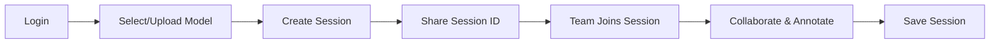

# InspectXR - Collaborative 3D Model Annotation Platform

A real-time collaborative desktop application for inspecting, annotating, and analyzing 3D models, built with Unity and Spring Boot.

[](https://unity.com/) [](https://spring.io/projects/spring-boot) [](https://www.oracle.com/java/) [](https://www.postgresql.org/)

## Overview

InspectXR transforms how teams collaborate on 3D models by enabling real-time annotation, synchronized navigation, and persistent session management. Perfect for architects, engineers, educators, and designers who need to examine and discuss 3D objects remotely.

### Key Features

-   **Dual Annotation System**
    
    -   Point annotations for precise location marking
    -   Paint annotations for freehand drawing on model surfaces
-   **Real-Time Multiplayer**
    
    -   Synchronized user positions and movements
    -   Instant annotation updates across all connected clients
    -   Live collaboration with multiple team members
-   **Advanced Inspection Tools**
    
    -   Texture examination with zoom functionality
    -   Base, normal, and occlusion map visualization
    -   Layer opacity and visibility controls
-   **Persistent Sessions**
    
    -   Save and resume collaborative sessions
    -   Complete annotation history
    -   Model and session management

## Architecture

```
┌─────────────────┐         ┌──────────────────┐         ┌─────────────────┐
│                 │         │                  │         │                 │
│  Unity Client   │◄───────►│  Spring Boot API │◄───────►│   PostgreSQL    │
│   (C#/Netcode)  │  REST   │   (Java 17)      │   JPA   │    Database     │
│                 │         │                  │         │                 │
└─────────────────┘         └──────────────────┘         └─────────────────┘
        │                            │
        │     RPC Sync               │
        └────────────────────────────┘
           Real-time Updates

```

### Technology Stack

**Frontend (Unity)**

-   Unity 2022.3.21f1 LTS
-   Unity Netcode for GameObjects (Multiplayer)
-   UI Toolkit (Modern declarative UI)
-   GLTFast (3D model loading)
-   TextMeshPro (Text rendering)

**Backend (Spring Boot)**

-   Spring Boot 3.4.5
-   Spring Data JPA + Hibernate ORM
-   PostgreSQL Database
-   MapStruct (DTO mapping)
-   Swagger/OpenAPI (API documentation)

**Communication Protocols**

-   HTTP/REST for persistent data operations
-   RPC for real-time multiplayer synchronization

## Getting Started

### Prerequisites

-   **Java 17+** for Spring Boot backend
-   **PostgreSQL 13+** for database
-   **Windows 10+** (current build target)
-   **8GB RAM** minimum
-   **Git** for cloning the repository

### Installation

1.  **Clone the repository**

```bash
git clone https://github.com/Sergiu3107/inspectxr.git
cd inspectxr

```

2.  **Setup PostgreSQL Database**

```sql
CREATE DATABASE inspectxr_db;
-- Username: postgres
-- Password: admin

```

3.  **Configure Spring Boot**

Edit `application.properties`:

```properties
database.ip=localhost
database.port=5432
database.user=postgres
database.password=admin
database.name=inspectxr_db

```

4.  **Run the Backend**

```bash
cd backend
./mvnw spring-boot:run

```

5.  **Launch the Unity Client**

-   Download the latest release from [Releases](https://github.com/Sergiu3107/inspectxr/releases)
-   Run `InspectXR.exe`

## Usage Guide

### Authentication

Users authenticate with username and password credentials, which are validated through the REST API.

### Model Management

-   **Add Models**: Upload `.glb`, `.gltf`, or `.zip` archives containing 3D models
-   **Delete Models**: Remove models from your library
-   **Create Sessions**: Start collaborative sessions with selected models

### Navigation Controls

-   `W/A/S/D` - Move forward/left/backward/right
-   `Space` - Move up
-   `Left Ctrl` - Move down
-   `Mouse` - Look around
-   `ESC` - Return to menu

### Annotation Tools

-   `1` - Activate point annotation mode
-   `2` - Activate paint annotation mode
-   `Z` - Toggle texture inspection zoom

### Point Annotations

1.  Click on the model to place a marker
2.  Enter descriptive text
3.  Save to persist across sessions
4.  Edit or delete by clicking existing markers

### Paint Annotations

1.  Select a color from the picker
2.  Click and drag to draw on the model
3.  Add description text
4.  Manage layers with opacity and visibility controls

## Key Workflows

### Collaborative Session Flow



### Annotation Rendering Pipeline

The application uses custom shaders to render annotations: a Draw Shader generates alpha masks from user input, and a Layer Shader composites these masks with colors onto the base model texture.

## Database Schema

```sql
users ──< models
  │
  └──< sessions >──< session_participants
         │
         └──< annotations
                ├── point_annotations
                └── paint_annotations

```

## Development

### Project Structure

```
inspectxr/
├── backend/                    # Spring Boot REST API
│   ├── controller/            # HTTP endpoints
│   ├── service/               # Business logic
│   ├── repository/            # Data access
│   ├── entity/                # JPA entities
│   └── dto/                   # Data transfer objects
│
└── unity-client/              # Unity application
    ├── API/                   # REST client
    ├── Network/               # Multiplayer sync
    ├── Paint/                 # Drawing system
    ├── Point/                 # Point annotations
    ├── Service/               # Core services
    └── UI/                    # User interface

```

### API Documentation

Once the backend is running, access Swagger UI at:

```
http://localhost:8080/swagger-ui.html

```

### Key Endpoints

-   `POST /user/login` - User authentication
-   `POST /model` - Upload new 3D model
-   `POST /sessions` - Create collaboration session
-   `POST /annotation/point` - Add point annotation
-   `POST /annotation/paint` - Add paint annotation

## Testing

The application has been tested using manual functional and usability testing, including multiplayer scenarios with three simultaneous clients to verify real-time synchronization.

Testing tools used:

-   Unity Editor + ParallelSync for multiplayer testing
-   Swagger UI for REST API testing
-   Postman for endpoint validation

## Use Cases

-   **Architecture & Engineering**: Review building designs and structural plans
-   **Education**: Teach anatomy, technical drawing, or industrial design
-   **Medical Training**: Study anatomical models collaboratively
-   **Product Design**: Review and iterate on 3D prototypes
-   **Remote Collaboration**: Enable distributed teams to work together

## Current Limitations

-   Windows-only (cross-platform support planned)
-   Performance considerations with very large/complex models
-   Basic authentication (no OAuth/SSO integration yet)

## Future Roadmap

-   [ ] Cross-platform support (macOS, Linux)
-   [ ] Web-based client version
-   [ ] VR/AR integration for immersive inspection
-   [ ] LiDAR scanning integration
-   [ ] Advanced authentication with role-based access
-   [ ] Performance optimization for complex models
-   [ ] Additional 3D file format support

## License

This project was developed as a bachelor's thesis at the Faculty of Automation and Computer Science, Computer Science Department.
